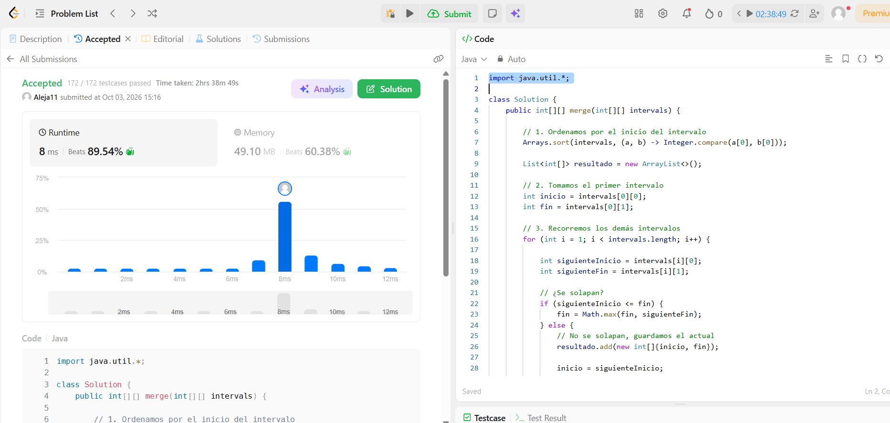
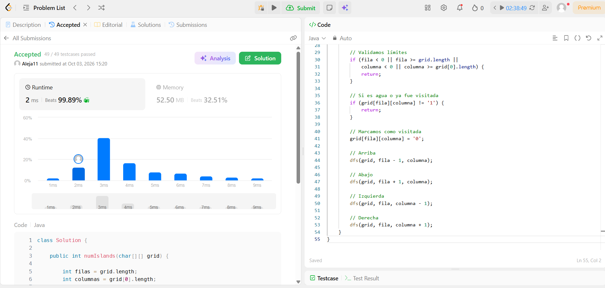
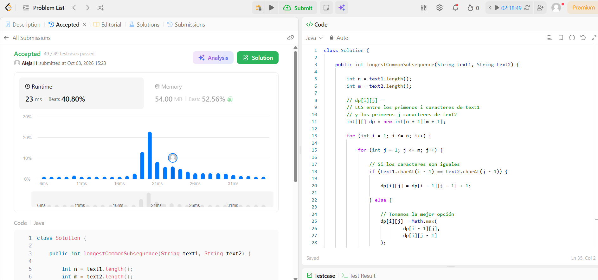
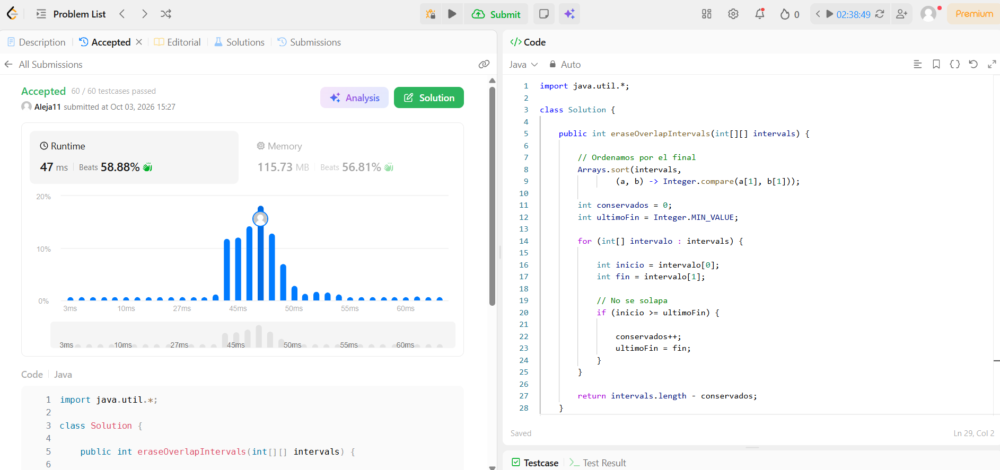
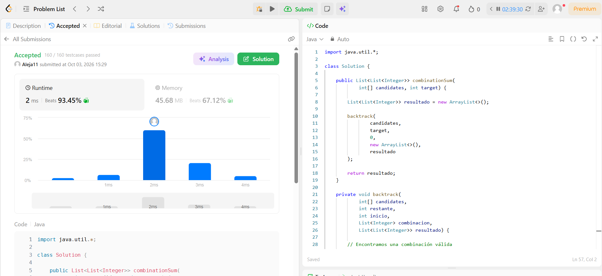

# Taller · Cinco familias en LeetCode

**Curso:** Análisis de Algoritmos · ITM · 2026-2

## Introducción

En este taller se resuelven cinco problemas de LeetCode aplicando diferentes familias de algoritmos: ordenamiento, grafos, programación dinámica, greedy y backtracking.

---

## Ejercicio 1 · 56. Merge Intervals

**Familia:** Ordenamiento

**Enlace:**  
https://leetcode.com/problems/merge-intervals/

**Idea:**  
Primero ordeno los intervalos por su extremo izquierdo (`start`). Luego recorro los intervalos de izquierda a derecha manteniendo un intervalo actual. Si el siguiente intervalo se solapa con el actual, actualizo el extremo final. Si no se solapan, guardo el intervalo actual y comienzo uno nuevo.

**Complejidad:**

- Tiempo: `O(n log n)`, debido al ordenamiento.
- Espacio: `O(n)` para la salida.

**Evidencia:**



---

## Ejercicio 2 · 200. Number of Islands

**Familia:** Grafos

**Enlace:**  
https://leetcode.com/problems/number-of-islands/

**Idea:**  
La matriz se interpreta como un grafo implícito. Cada celda con valor `'1'` representa tierra y se conecta con sus vecinos de arriba, abajo, izquierda y derecha. Recorro la matriz y, cuando encuentro una celda `'1'` que no ha sido visitada, aumento el contador de islas y utilizo DFS para recorrer toda la componente conectada.

**Complejidad:**

- Tiempo: `O(m × n)`.
- Espacio: `O(m × n)` en el peor caso.

Donde `m` es el número de filas y `n` el número de columnas.

**Evidencia:**



---

## Ejercicio 3 · 1143. Longest Common Subsequence

**Familia:** Programación dinámica

**Enlace:**  
https://leetcode.com/problems/longest-common-subsequence/

**Idea:**  
Utilizo una tabla `dp` donde `dp[i][j]` representa la longitud de la subsecuencia común más larga entre los primeros `i` caracteres de `text1` y los primeros `j` caracteres de `text2`.

Si los caracteres son iguales:

```text
dp[i][j] = dp[i-1][j-1] + 1
```

Si son diferentes:

```text
dp[i][j] = max(dp[i-1][j], dp[i][j-1])
```

**Complejidad:**

- Tiempo: `O(n × m)`.
- Espacio: `O(n × m)`.

Donde `n` es la longitud de `text1` y `m` es la longitud de `text2`.

**Evidencia:**



---

## Ejercicio 4 · 435. Non-overlapping Intervals

**Familia:** Greedy

**Enlace:**  
https://leetcode.com/problems/non-overlapping-intervals/

**Idea:**  
Ordeno los intervalos por su extremo final (`end`). Después recorro los intervalos y selecciono el que termina primero siempre que no se solape con el último intervalo seleccionado.

Al final, la cantidad de intervalos que debo eliminar es la cantidad total de intervalos menos la cantidad de intervalos que pude conservar.

El criterio greedy consiste en elegir el intervalo que termina más temprano para dejar disponible la mayor cantidad de espacio para los siguientes intervalos.

**Complejidad:**

- Tiempo: `O(n log n)`, debido al ordenamiento.
- Espacio: `O(1)` adicional si se ordena sobre el mismo arreglo.

**Evidencia:**



---

## Ejercicio 5 · 39. Combination Sum

**Familia:** Backtracking

**Enlace:**  
https://leetcode.com/problems/combination-sum/

**Idea:**  
Utilizo backtracking para construir las diferentes combinaciones. En cada paso elijo un candidato y lo agrego a la combinación actual. Si la suma alcanza el `target`, guardo la combinación. Si la suma supera el `target`, termino esa rama.

Después de explorar una opción, retiro el último elemento de la combinación para poder probar otra posibilidad. Este proceso corresponde a elegir, explorar y deshacer.

Para evitar generar combinaciones repetidas en diferente orden, continúo la búsqueda desde el índice actual y no desde índices anteriores.

**Complejidad:**

- Tiempo: exponencial en el peor caso debido a la enumeración de combinaciones.
- Espacio: exponencial en el peor caso considerando la salida y la profundidad de la búsqueda.

**Evidencia:**



---

# Estructura del proyecto

```text
taller/
├── README.md
├── merge-intervals/
├── number-of-islands/
├── longest-common-subsequence/
├── non-overlapping-intervals/
├── combination-sum/
└── evidencias/
    ├── merge-intervals-accepted.png
    ├── number-of-islands-accepted.png
    ├── longest-common-subsequence-accepted.png
    ├── non-overlapping-intervals-accepted.png
    └── combination-sum-accepted.png
```

# Resumen de los algoritmos

| # | Problema | Familia | Complejidad |
|---|---|---|---|
| 1 | Merge Intervals | Ordenamiento | `O(n log n)` |
| 2 | Number of Islands | Grafos | `O(m × n)` |
| 3 | Longest Common Subsequence | Programación dinámica | `O(n × m)` |
| 4 | Non-overlapping Intervals | Greedy | `O(n log n)` |
| 5 | Combination Sum | Backtracking | Exponencial |

# Evidencias

Cada ejercicio cuenta con una captura de pantalla del resultado **Accepted** en LeetCode. Las evidencias se encuentran en la carpeta `evidencias/`.

# Conclusión

En el taller se aplicaron cinco familias de algoritmos:

- **Ordenamiento:** ordenar intervalos y fusionarlos.
- **Grafos:** recorrer componentes conexas mediante DFS.
- **Programación dinámica:** utilizar una tabla de estados para resolver LCS.
- **Greedy:** seleccionar intervalos según el criterio de menor tiempo de finalización.
- **Backtracking:** construir combinaciones mediante elección, exploración y retroceso.