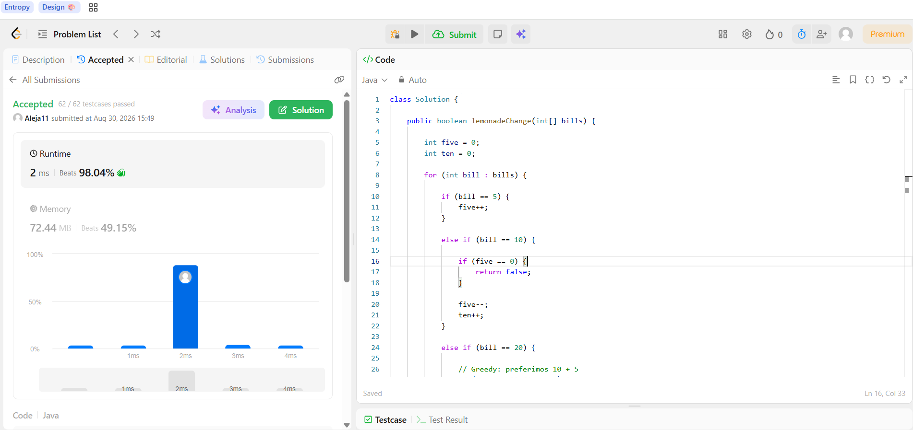
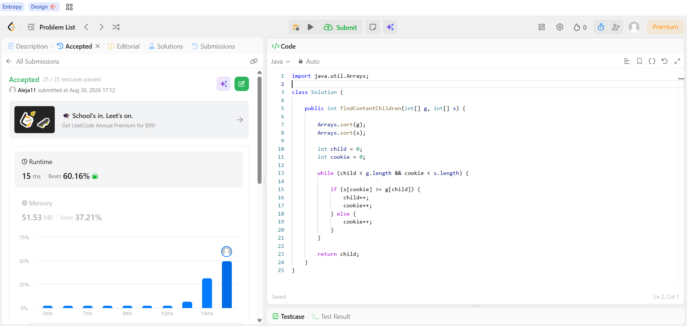

# Tarea 1 - Algoritmos Greedy en LeetCode

**Curso:** Análisis de Algoritmos  
**Tema:** Algoritmos Greedy (Voraces)  
**Lenguaje:** Java

---

## 1. 860. Lemonade Change

**Problema:**  
[860. Lemonade Change](https://leetcode.com/problems/lemonade-change/)

### Solución

La solución recorre los clientes en el orden en que aparecen y lleva la cantidad de billetes de $5 y $10 disponibles.

Cuando un cliente paga con $5, simplemente se guarda el billete.

Cuando paga con $10, se utiliza un billete de $5 para dar el cambio.

Cuando paga con $20, se necesita devolver $15. En este caso se utiliza primero un billete de $10 y uno de $5. Si no es posible, se utilizan tres billetes de $5.

Si no es posible entregar el cambio exacto, se retorna `false`.

### Criterio Greedy

La decisión greedy consiste en entregar, cuando sea posible, un billete de $10 y uno de $5 para devolver $15.

Se prefiere esta opción porque permite conservar los billetes de $5, que son más útiles para dar cambio a los siguientes clientes.

La decisión se toma en cada cliente y no se modifican las decisiones anteriores.

### Complejidad

- **Tiempo:** `O(n)`, porque se recorre el arreglo una sola vez.
- **Espacio:** `O(1)`, porque solo se utilizan dos contadores.

### Código

[Ver código de Lemonade Change](lemonade-change/Solution.java)

### Evidencia de Accepted

---

## 2. 455. Assign Cookies

**Problema:**  
[455. Assign Cookies](https://leetcode.com/problems/assign-cookies/)

### Solución

Primero se ordenan los niños y las galletas de menor a mayor.

Después se utilizan dos posiciones para recorrer los arreglos. Se intenta satisfacer primero al niño con menor factor de gula utilizando la galleta más pequeña disponible que pueda satisfacerlo.

Si la galleta es demasiado pequeña, se descarta y se prueba con la siguiente.

### Criterio Greedy

La decisión greedy consiste en utilizar la galleta más pequeña que todavía pueda satisfacer al niño actual.

De esta manera se evita utilizar una galleta grande para un niño que puede ser satisfecho con una más pequeña, dejando las galletas grandes disponibles para los niños que tengan mayores necesidades.

### Complejidad

Si `n` es la cantidad de niños y `m` es la cantidad de galletas:

- **Tiempo:** `O(n log n + m log m)`, debido a la ordenación de los dos arreglos.
- **Espacio:** `O(1)` de espacio auxiliar para la lógica del algoritmo.

### Código

[Ver código de Assign Cookies](assign-cookies/Solution.java)

### Evidencia de Accepted

