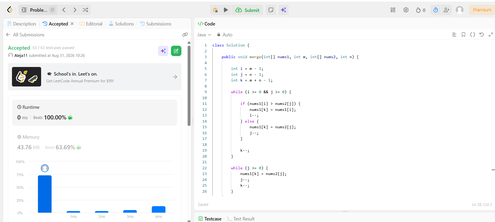
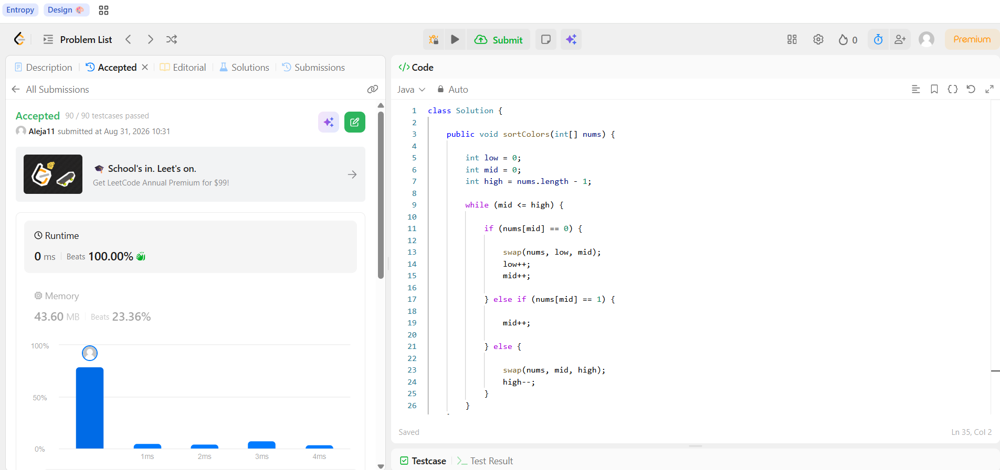

# Tarea 2 - Algoritmos de Ordenamiento en LeetCode

**Curso:** Análisis de Algoritmos  
**Tema:** Algoritmos de Ordenamiento  
**Lenguaje:** Java

---

## 1. 88. Merge Sorted Array

**Problema:**  
[88. Merge Sorted Array](https://leetcode.com/problems/merge-sorted-array/)

### Algoritmo utilizado

Se utiliza el algoritmo de **fusión (Merge)** desde el final de los dos arreglos.

Los dos arreglos ya se encuentran ordenados, por lo que se utilizan tres índices:

- `i`: apunta al último elemento válido de `nums1`.
- `j`: apunta al último elemento de `nums2`.
- `k`: indica la posición donde se debe escribir el siguiente elemento en `nums1`.

Se comparan los elementos de `nums1` y `nums2` desde el final y se coloca el elemento mayor en la posición `k`.

La fusión se realiza desde el final para evitar sobrescribir los elementos de `nums1` que todavía no han sido procesados.

No se utiliza ningún método de ordenamiento de la librería.

### ¿Por qué utilizar este algoritmo?

Los dos arreglos ya están ordenados, por lo que no es necesario volver a ordenar todos los elementos.

La fusión permite recorrer los elementos una sola vez y aprovechar el orden que ya existe.

Además, al realizar la fusión desde el final se puede modificar `nums1` directamente sin utilizar un arreglo adicional.

### Complejidad

Si `m` es la cantidad de elementos válidos de `nums1` y `n` es la cantidad de elementos de `nums2`:

- **Tiempo:** `O(m + n)`
- **Espacio adicional:** `O(1)`

La solución modifica `nums1` directamente.

### Código

[Ver código de Merge Sorted Array](merge-sorted-array/Solution.java)

### Evidencia de Accepted



---

## 2. 75. Sort Colors

**Problema:**  
[75. Sort Colors](https://leetcode.com/problems/sort-colors/)

### Evidencia de Accepted




### Algoritmo utilizado

Se utiliza el algoritmo de la **Bandera Holandesa (Dutch National Flag)** utilizando tres punteros:

- `low`: posición donde deben quedar los `0`.
- `mid`: posición actual que se está revisando.
- `high`: posición donde deben quedar los `2`.

El arreglo solamente contiene los valores `0`, `1` y `2`.

La estrategia es:

- Si `nums[mid]` es `0`, se intercambia con `low` y se avanzan `low` y `mid`.
- Si `nums[mid]` es `1`, simplemente se avanza `mid`.
- Si `nums[mid]` es `2`, se intercambia con `high` y se disminuye `high`.

Cuando se encuentra un `2`, `mid` no se incrementa inmediatamente porque el elemento que llegó desde `high` todavía debe ser revisado.

### ¿Por qué utilizar este algoritmo?

El problema tiene un universo muy pequeño de claves:

```text
0, 1 y 2