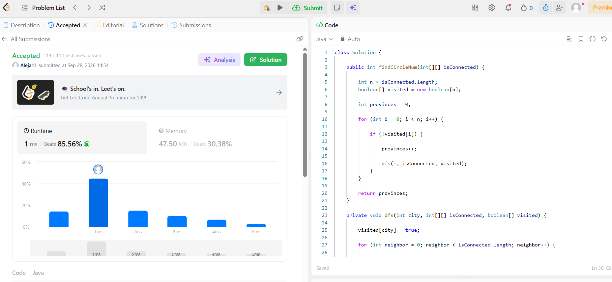
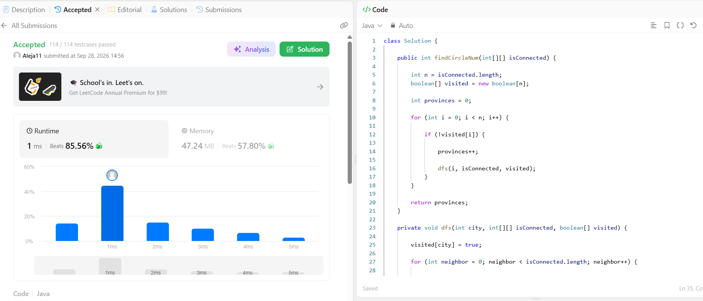

# Tarea 3 - Grafos en LeetCode

**Curso:** Análisis de Algoritmos  
**Tema:** Grafos  
**Lenguaje:** Java

---

## 1. 547. Number of Provinces

**Problema:**  
[547. Number of Provinces](https://leetcode.com/problems/number-of-provinces/)

### Modelo del grafo

- **Vértices:** cada ciudad representa un vértice.
- **Aristas:** existe una arista entre dos ciudades cuando `isConnected[i][j] == 1`.
- **Tipo de grafo:** no dirigido, porque la conexión entre las ciudades es recíproca.
- **Provincia:** corresponde a una componente conexa del grafo.

### Algoritmo utilizado

Se utiliza **DFS (Depth-First Search)** para encontrar las componentes conexas.

Se recorren todas las ciudades y se utiliza un arreglo `visited` para saber cuáles ya fueron visitadas.

Cuando se encuentra una ciudad que todavía no ha sido visitada, significa que se encontró una nueva provincia. Se incrementa el contador de provincias y se ejecuta DFS desde esa ciudad para visitar todas las ciudades que pertenecen al mismo grupo.

De esta manera, cada componente conexa se cuenta exactamente una vez.

### Complejidad

Si `n` es el número de ciudades:

- **Tiempo:** `O(n²)`, porque `isConnected` es una matriz de `n × n` y se recorren sus conexiones.
- **Espacio adicional:** `O(n)`, debido al arreglo `visited` y a la profundidad máxima de la recursión DFS.

### Código

[Ver código de Number of Provinces](number-of-provinces/Solution.java)

### Evidencia de Accepted

---

## 2. 207. Course Schedule

**Problema:**  
[207. Course Schedule](https://leetcode.com/problems/course-schedule/)

### Modelo del grafo

- **Vértices:** cada curso representa un vértice.
- **Aristas:** para cada prerrequisito `[a, b]`, se crea una arista `b → a`.
- **Tipo de grafo:** dirigido.
- **Ciclo:** representa una dependencia circular entre cursos que impide completar todos los cursos.

### Algoritmo utilizado

Se utiliza **BFS con el algoritmo de Kahn**, también conocido como ordenamiento topológico.

Primero se construye una lista de adyacencia para representar el grafo y se calcula el grado de entrada (`indegree`) de cada curso.

Los cursos que tienen `indegree = 0` no tienen prerrequisitos pendientes, por lo que pueden cursarse inmediatamente y se agregan a una cola.

Cada vez que se procesa un curso, se recorren sus cursos dependientes y se reduce su `indegree`. Cuando un curso llega a `indegree = 0`, se agrega a la cola.

Al finalizar, se compara la cantidad de cursos procesados con `numCourses`.

Si todos los cursos fueron procesados, no existe un ciclo y se retorna `true`.

Si quedaron cursos sin procesar, existe un ciclo de prerrequisitos y se retorna `false`.

### Complejidad

Si `n` es el número de cursos y `m` es el número de prerrequisitos:

- **Tiempo:** `O(n + m)`.
- **Espacio adicional:** `O(n + m)`, debido a la lista de adyacencia, el arreglo `indegree` y la cola.

### Código

[Ver código de Course Schedule](course-schedule/Solution.java)

### Evidencia de Accepted

---

## Conclusión

En esta tarea se aplicaron dos algoritmos de grafos.

En **Number of Provinces** se utilizó DFS para recorrer el grafo no dirigido y contar sus componentes conexas.

En **Course Schedule** se utilizó BFS mediante el algoritmo de Kahn para realizar un ordenamiento topológico y determinar si el grafo dirigido contiene un ciclo de prerrequisitos.

Los dos algoritmos permiten resolver los problemas recorriendo las relaciones del grafo y tienen complejidades adecuadas para el tamaño de las entradas.